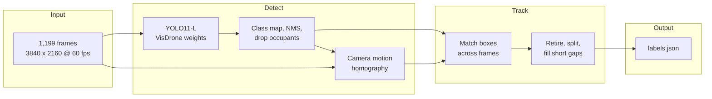
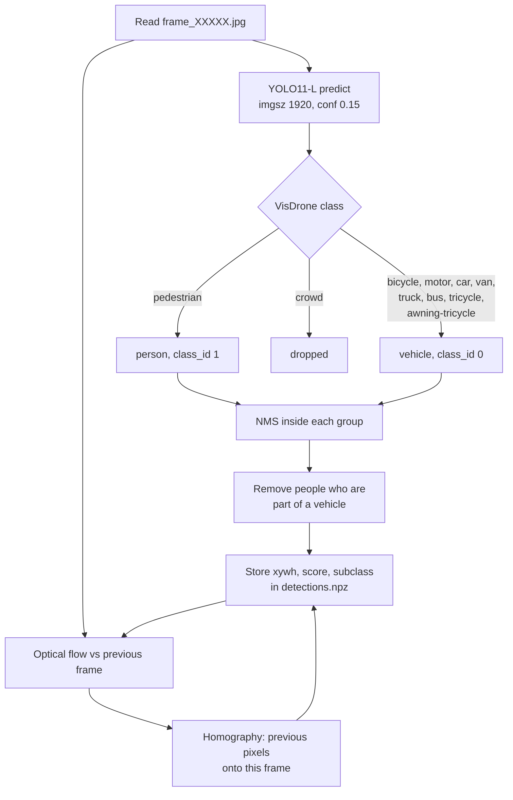
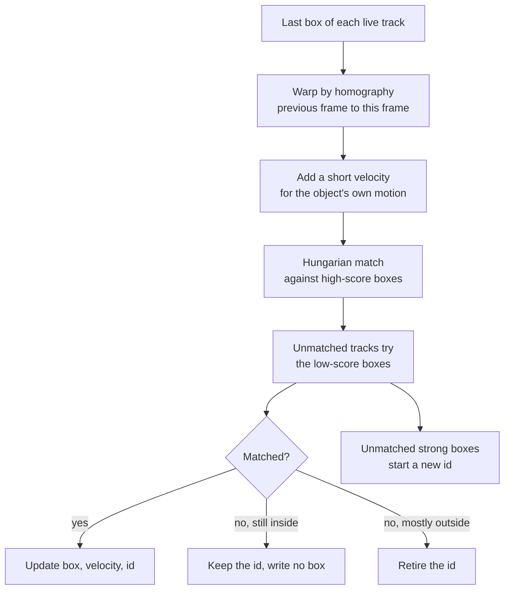
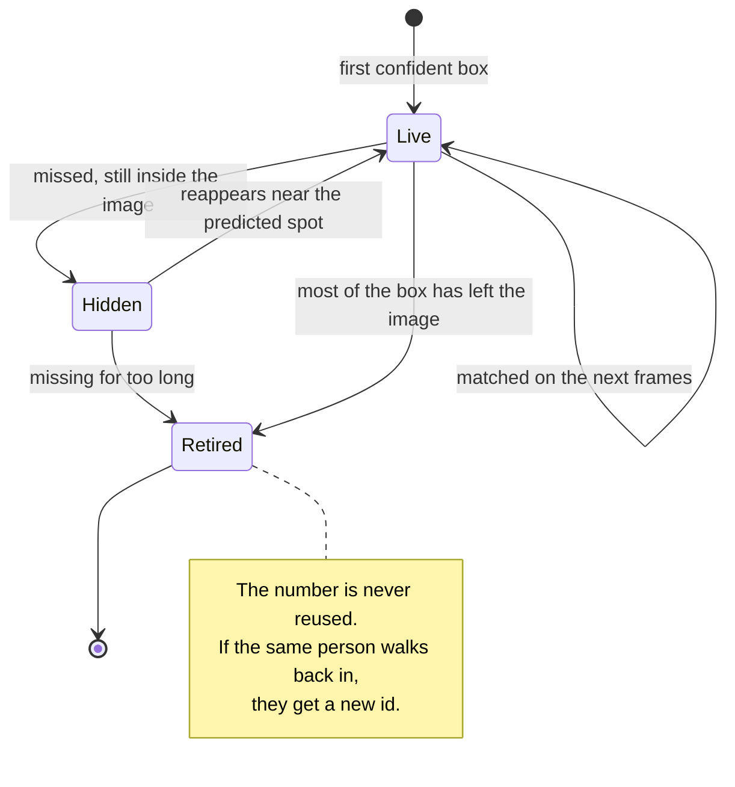
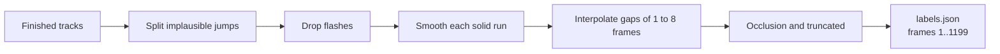

# F05 dense 4K — vehicle and person tracking

One 20-second drone shot, labeled on every frame, for two jobs at once: **detection** (where things are) and **multi-object tracking** (which object is which from frame to frame). The thing that makes tracking possible is `instance_id`. The same physical car or person keeps the same id until it leaves the picture.

| | |
|---|---|
| Clip | `F05_dense_4k` |
| Frames | 1,199 JPEGs, `frame_00001.jpg` … `frame_01199.jpg` |
| Size | 3840 × 2160, native 60 fps, no frames dropped |
| Classes | `0` vehicle, `1` person |
| Labels | 401,510 boxes, ids `1`–`1786` (1,170 vehicles, 616 people) |

The original frames are not in this repo. They stay as extracted JPEGs. Nothing here resizes, renames, or re-encodes them.

## High-level architecture

The clip is too dense to draw by hand. A detector proposes a box on every frame. A tracker then decides which boxes are the same object.



Detection answers “what is in this frame.” Tracking answers “is this the same car as last frame.” Those stay separate on purpose. A bad box can be fixed without changing ids, and a broken id is not hidden by a pretty box.

## Low-level architecture

### 1. Detect one frame

The network runs at an inference size of **1920**. The JPEG is never rewritten. Returned boxes are already in the original 3840 × 2160 pixel coordinates.



**Why mask the vehicles out of the camera estimate.** The homography should describe the drone, not the traffic. Feature points that land inside a detection are ignored, so a moving car does not pull the camera motion with it.

**Why riders are a special case.** A two-wheeler is always a vehicle. The rider is also a person only when their box clearly sticks up above the vehicle. If person and bike are one blob, only the vehicle is kept. People inside a car, van, truck, or bus are removed.

### 2. Link boxes into tracks

Matching is done after the camera motion is removed. At 60 fps a car only moves a few pixels on its own. The drone sometimes moves about 40 pixels in one frame, near frame 1020. Matching in the raw image would treat that pan as the object jumping.



Two association passes are the ByteTrack idea. A confident box claims a track first. A weaker box may extend a track that already exists, but it cannot mint a new id by itself. That stops one-frame noise from becoming a person or a bike.

### 3. What happens to an id



| Situation | What the file does |
|---|---|
| Steady motion | Same `instance_id`. Box comes from that frame's detection. |
| Detector drops out for 1–8 frames | Same id. The gap is a straight line between the two real boxes. |
| Fully hidden for longer | Same id, **no box** on the empty frames, if it comes back near the camera-compensated position within 48 frames (0.8 s). |
| Comes back far from that position | New id. A wrong merge is worse than a split. |
| Crosses the image edge | Id retired. Last boxes are `truncated: true` and cover only the visible part. |
| Parked car or a person standing still | Same id the whole time they are in frame. |

Ids start at 1 and are handed out in order of first appearance. Vehicles and people share one pool, so there is never a vehicle 3 and a person 3.

### 4. Write `labels.json`

After linking:

1. Split a track when the camera-compensated jump is too big to be the same object.
2. Drop tracks that only flashed for a frame or two.
3. Median-smooth box center and size **inside a contiguous run only**. A time gap must not blend two positions into a box that sits on neither.
4. Fill gaps of at most 8 frames. If a filled box would be almost completely covered by something nearer, that frame is left empty.
5. Set `occlusion` from overlap with a nearer box. In this oblique view, nearer means the other box's bottom edge is lower in the image.
6. Clip every box to the image. Touching the border sets `truncated` to true.



Occlusion values:

| Value | Meaning used here |
|---|---|
| 0 | Less than about 18% covered |
| 1 | Covered, up to about half |
| 2 | More than about half covered |

Partly hidden objects keep the detected box. The box is not stretched to a guessed full outline of the hidden part. Frames where the object is completely hidden have no record.

## Output

```json
{
  "clip": "F05_dense_4k",
  "image_size": [3840, 2160],
  "fps": 60,
  "frame_count": 1199,
  "annotator": "divyanshu",
  "frames": [
    {
      "sequence": 1,
      "detections": [
        {
          "box": [723.4, 2.7, 21.0, 18.6],
          "class_id": 0,
          "instance_id": 1,
          "occlusion": 0,
          "truncated": false
        }
      ]
    }
  ]
}
```

`box` is `[x, y, w, h]` in pixels, origin at the top left. `sequence` is the number in the filename (`frame_00007.jpg` → `7`). Every frame from 1 to 1199 appears once. An empty frame would be `"detections": []`. An `instance_id` never appears twice in the same frame.

## Repository layout

```
annotate.py              pipeline: detect, track, qa
detections.npz           per-frame boxes and the homography for each step
labels.json              submission file
models/yolo11l-visdrone.pt
note.txt                 judgement calls from the annotation pass
requirements.txt
```

`detections.npz` holds, for every frame, rows of `[x, y, w, h, confidence, visdrone_class]` plus a 3×3 homography that maps the previous frame onto the current one. Tracking reads this file. It does not run the network again.

## Run it

```bash
python3 -m venv .venv
source .venv/bin/activate
pip install -r requirements.txt
```

Point `FRAMES` at the top of `annotate.py` to the folder of `frame_00001.jpg` … `frame_01199.jpg`.

```bash
python3 annotate.py detect    # writes detections.npz, needs the weights and the frames
python3 annotate.py track     # writes labels.json from detections.npz
python3 annotate.py qa        # draws a few sample frames into qa/
python3 annotate.py all
```

`track` checks the file before it exits: header values, frames 1–1199 exactly once, legal classes, no duplicate id inside a frame, ids are a contiguous range starting at 1.

On the machine this was built on, detection of all 1,199 frames took about 13 minutes. Linking the tracks took under a minute.

## Design choices

**A detection on every frame, not a sparse keyframe.** At 60 fps the usual hand method is a keyframe every 10–30 frames and a linear fill. That fill drifts on turns, stops, and occlusions, and those middle frames are exactly what a tracker is scored on. Here the network sees every frame, so interpolation is only a patch for a short miss.

**Camera motion is removed before matching.** Identity is about the object, not about the drone sliding over the city.

**Short coast, then a new id.** An object hidden inside the frame keeps its id. An object that has left, or that reappears far from the predicted place, does not. Guessing a merge across a crowd is worse than starting a new id.

**Small objects stay if they persist.** A box that shows up once is dropped. A small pedestrian or bike that the detector holds for several frames is kept. Distant objects are part of the task, not optional.

## What is still rough

Cement mixers and the tanker have looser boxes than the cars. In the dense queue two boxes sometimes touch. Occlusion is estimated from overlap, and a partly hidden box is not expanded to a hand-drawn full extent. A few dark poles and rooftop shapes can still hold a person or bike id when the detector is steady on them. Those calls are written up in `note.txt`.
